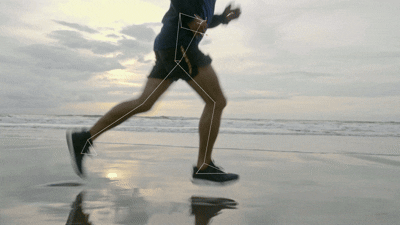
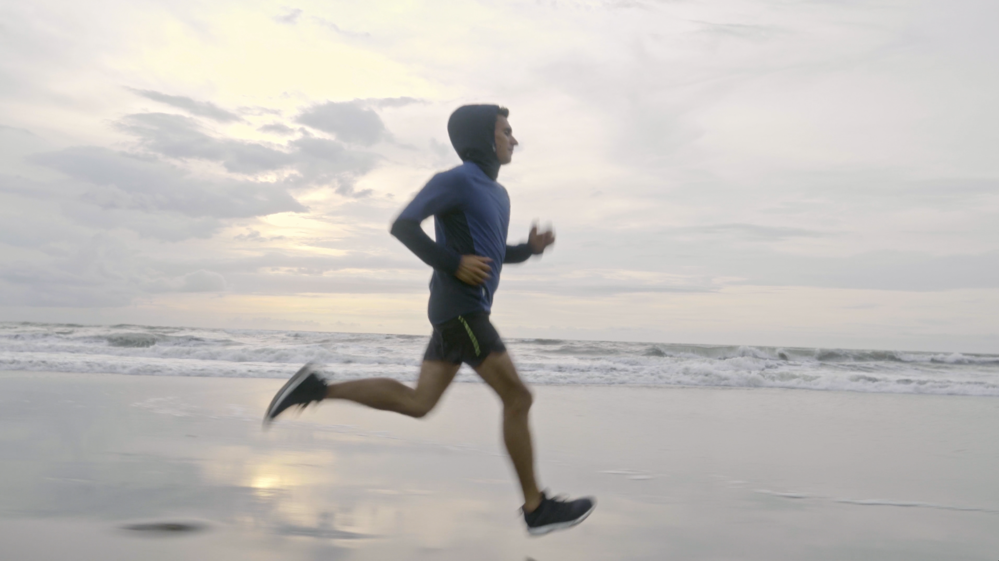
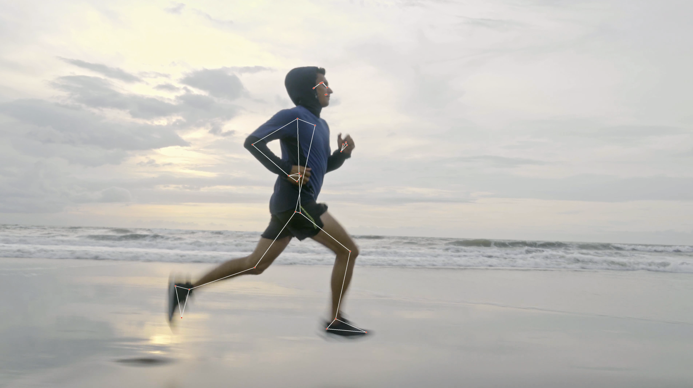

# Autonomous Runner: Video-Based Gait Analytics

Autonomous Runner is a computer vision platform that transforms standard running videos into precise biomechanical data. By leveraging MediaPipe for pose estimation and SciPy for signal processing, the platform extracts key performance metrics such as cadence, vertical oscillation, and fatigue markers without the need for wearable sensors.

## Features

- **Pose Estimation:** Uses MediaPipe to track 33 key body landmarks in real-time.
- **Cadence Tracking:** Automatically detects foot strikes using Y-axis ankle peaks.
- **Biomechanical Metrics:** Calculates vertical oscillation (hip bounce), symmetry scores, and approximate stride length.
- **Fatigue Detection:** Monitors cadence drift over time using a sliding window algorithm to identify performance drop-offs.
- **Visual Reports:** Generates annotated videos and analytical plots for performance review.

## Visuals 

The platform processes raw video input to identify key gait landmarks and provides an annotated overlay for form correction.

### **In-Action Tracking**


### **Gait Landmark Comparison**

| Input Frame | Annotated Pose Tracking |
| :---: | :---: |
|  |  |
| *Raw Input Video* | *Processed Analytics Overlay* |

## System Architecture

The pipeline consists of three primary stages:

1. **Extraction**
   - Processes raw video (`input.mp4`) to generate a coordinate-based CSV of joint movements.

2. **Visualization**
   - Overlays a skeletal rig onto the original video for manual form review.

3. **Analysis**
   - Runs signal processing on the extracted data to calculate metrics and generate plots.

## Technical Metrics Calculated

| Metric | Description |
|--------|-------------|
| Cadence | Steps per minute (SPM) derived from ankle peak frequency. |
| Vertical Oscillation | The vertical displacement of the hip center during a gait cycle. |
| Symmetry Score | Comparison of left vs. right foot strikes to identify gait imbalances. |
| Fatigue Frame | The point where cadence drops more than 5% below the initial baseline. |

## Getting Started

### Prerequisites

Ensure you have Python installed, then install the necessary dependencies:

```bash
pip install pandas numpy matplotlib scipy opencv-python mediapipe
```

### Usage

1. **Analyze Landmarks**
   - Run the landmark extraction script to generate `output.csv`.

2. **Generate Overlay**
   - Run the annotation script to produce `annotated.mp4`.

3. **Calculate Metrics**
   - Run the analysis script to generate `metrics.txt` and performance graphs.

```bash
python extract_landmarks.py
python annotate_video.py
python analyze_metrics.py
```

## Output Examples

The platform produces two key visualizations:

- **Cadence Plot:** A wave graph showing ankle height over time with marked foot strike points.
- **Fatigue Plot:** A trend line of cadence across the duration of the run, highlighting the exact frame where fatigue is detected.

## Notes

- For accurate stride length calculations, ensure the `RUNNER_HEIGHT_M` constant is updated to match the subject's actual height.
- Best results come from side-view treadmill footage with the runner fully visible in frame.
- Use a fixed camera and good lighting to improve landmark detection accuracy.

